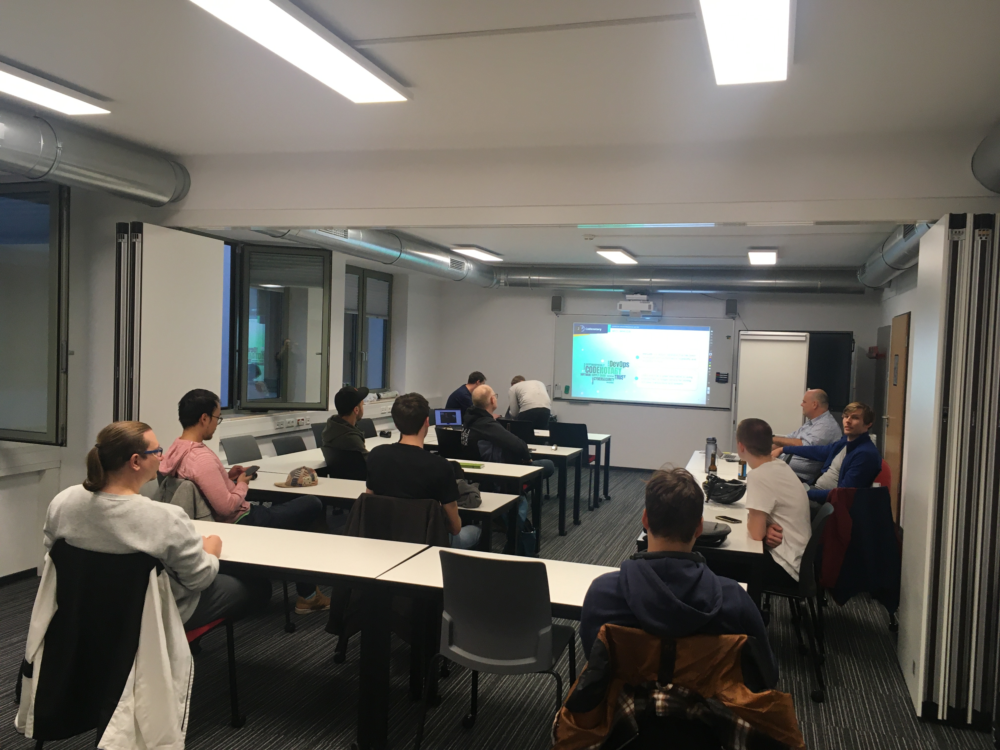
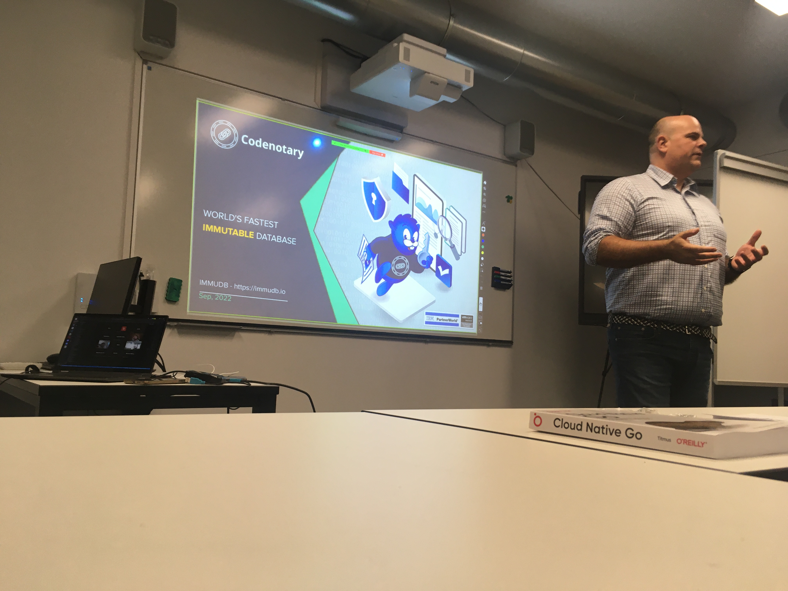
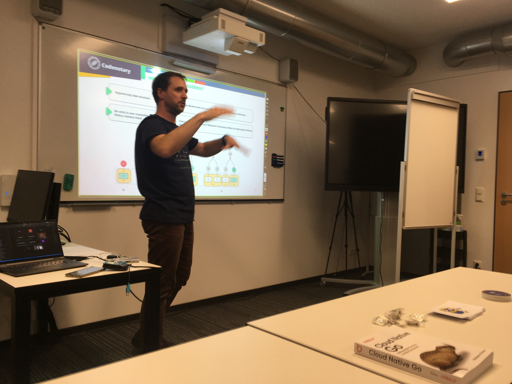

# Golang Leipzig x CodeNotary x Lancaster University Leipzig

* Author: [Martin Czygan](mailto:martin.czygan@gmail.com)
* Status: Draft

> Life does not always go as planned! Continued ...

Software development is as much about people as it is about programs - and many
people connect through tech meetups with their peers to learn about new
technologies and share experiences.

On Tuesday night (2022-09-20), Leipzig's Go Programming Language [1] had
scheduled a meetup, but alas their usual meeting place was part of an exclusion
zone - due to a old bomb find nearby [2].

Lancaster University Leipzig graciously offered a room on a very short notice
and allowed us to gather a dozen people for a great presentation by Dennis
Zimmer [3], CTO of Codenotary [4] and lead developer Bartłomiej Święcki [5] about a cutting-edge open source database called
immudb [6]. Evening saved!

We'd like to thank Lancaster University for their support - so that we could
learn and connect - you're awesome!

* [1] https://golangleipzig.space/
* [2] https://www.mdr.de/nachrichten/sachsen/leipzig/bombe-entschaerft-evakuierung-sperrkreis-polizei-100.html
* [3] https://www.linkedin.com/in/denniszimmer
* [4] https://codenotary.com
* [5] https://github.com/byo
* [6] https://immudb.io/

----

# Impressions

